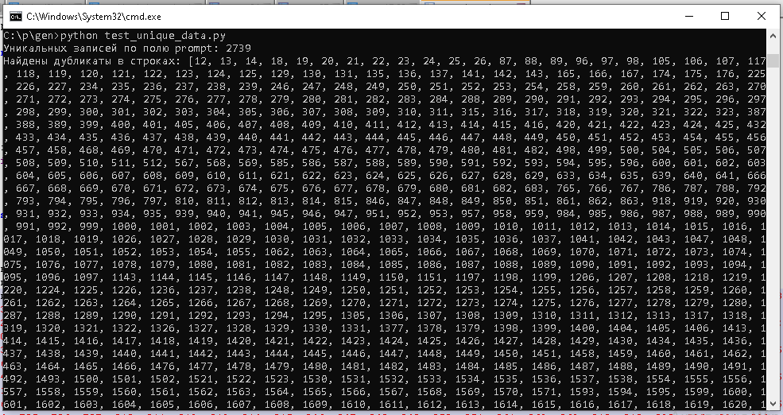
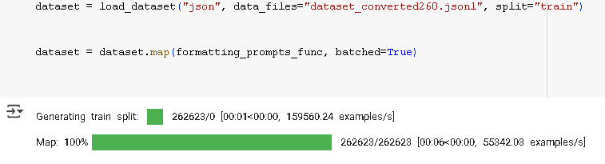
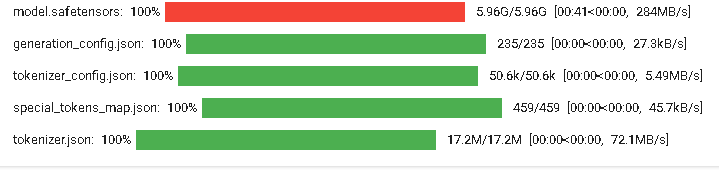

# Health Assistant LLM: Персонализированные медицинские рекомендации


**Разработка цифрового ассистента по здоровью на основе дообученной LLaMA 3.1.**

Проект оптимизирует LLaMA 3.1 для медицинских текстов, включая подготовку данных, генерацию синтетических текстов и дообучение с LoRA. Из-за NDA данные и модели не публикуются.

## Основные достижения
- **Подготовка данных**: Обработан медицинский датасет с нормализацией терминологии и структурированием в форматы вопрос-ответ (QA) и текстовые рекомендации (TXT).
- **Генерация синтетических данных**: Применены методы перефразирования, синонимизации, изменения структуры и суммаризации для увеличения объёма обучающей выборки.
- **Дообучение модели**: Адаптирована LLaMA 3.1 с LoRA-адаптером, достигнуты высокие метрики качества.
- **Оценка**: Проведена валидация модели, подтверждены её обобщающие способности.
- **Интеграция**: Модель подготовлена для внедрения в цифрового ассистента.

*Примечание*: Исходные данные конфиденциальны (NDA). LoRA-адаптер доступен по запросу.

## Структура репозитория

- `scripts/`: Код для подготовки данных, генерации текста и дообучения.
- `docs/`: Подробная документация методологии и результатов.
- `assets/`: Визуализации:
  - `figures/`: Графики.
  - `screenshots/`: Скриншоты этапов проекта.


## Установка
1. Клонируйте репозиторий:
   ```bash
   git clone https://github.com/EGubskayaML/health-assistant-llm.git
   cd health-assistant-llm

## Использование
*Примечание*: Для воспроизведения требуется доступ к данным. Примеры используют синтетические данные.

1. Подготовка данных:
   ```bash
   python scripts/data_preparation/load_data.py --input synthetic_sample.jsonl

2. Генерация синтетических данных:
   ```bash
   python scripts/synthetic_generation/pf_synt_data.py --input synthetic_sample.jsonl

3. Дообучение модели:
   ```bash
   python scripts/model_training/train_model.py --model unsloth/Meta-Llama-3.1-8B
Модель была оценена для проверки её способности генерировать точные рекомендации.

- **Метрики на обучающей выборке**:
  - Train Loss: 0.245

- **Синтетический пример**:
  **Вход**: "Профиль: Gene: ABC1, Polymorphism: rs12345, Variant: AA, Effect: +, Trait: nutrition."  
  **Выход**: "Анализ выявил умеренную потребность в сбалансированном питании."

Низкий Train Loss (0.245) указывает на успешное обучение модели. Метрики BLEU и ROUGE-L подтверждают высокое качество генерации рекомендаций.

## Документация

- [Методология](docs/methodology.md)
- [Подготовка данных](docs/data_preparation.md)
- [Генерация синтетических данных](docs/synthetic_data.md)
- [Дообучение модели](docs/model_training.md)
- [Результаты и метрики](docs/results.md)

## Скриншоты этапов проекта

Ниже представлены скриншоты, иллюстрирующие ключевые этапы проекта:

- **Анализ исходного датасета (подготовка данных)**:  
  

- **Форматирование данных (дообучение)**:  
  

- **Загрузка модели (дообучение)**:  
  

## Вклад

Приветствуются улучшения! Создайте issue или pull request. См. [CONTRIBUTING.md](CONTRIBUTING.md).

## Лицензия

[MIT License](LICENSE)

## Контакты

- **Автор**: Елена Губская
- **Email**: helenatroya729@gmail.com